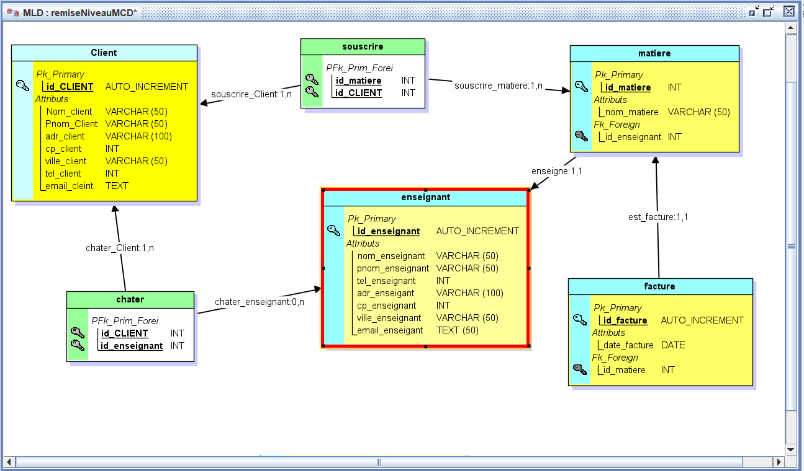

# projetNormalienCenter
Création d'un site de cours de remise à niveau en sciences

## Etape 1: SITE STATIQUE

### MCD

### MLD

### PAGE HTML

### PAGE CSS

## Patie 2: Dynamique du site avec PHP

